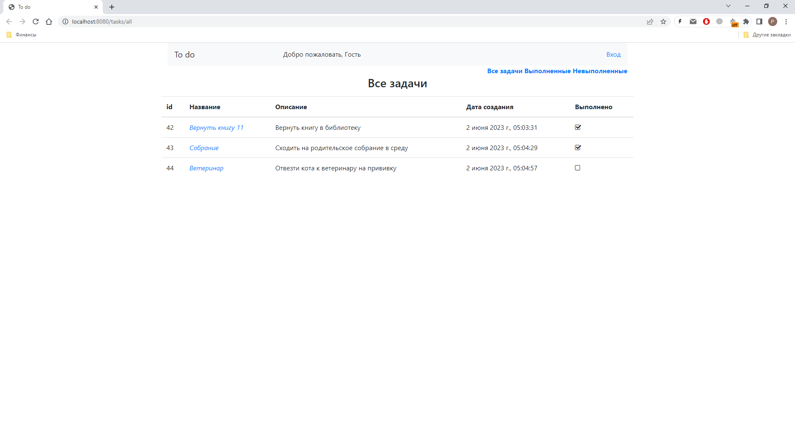
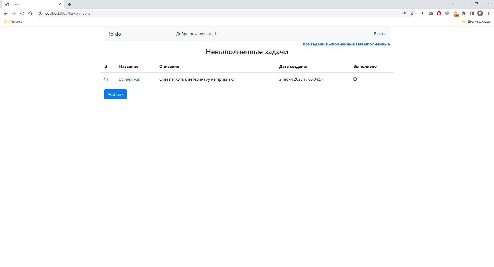
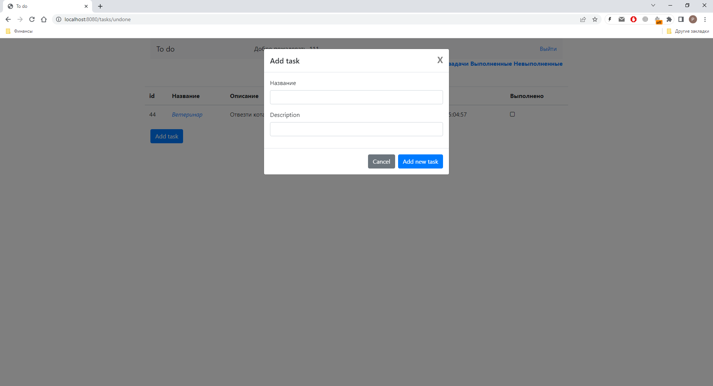
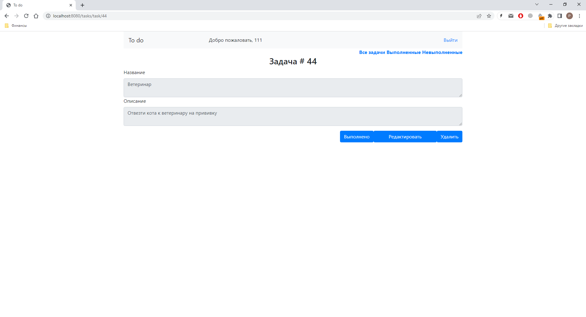
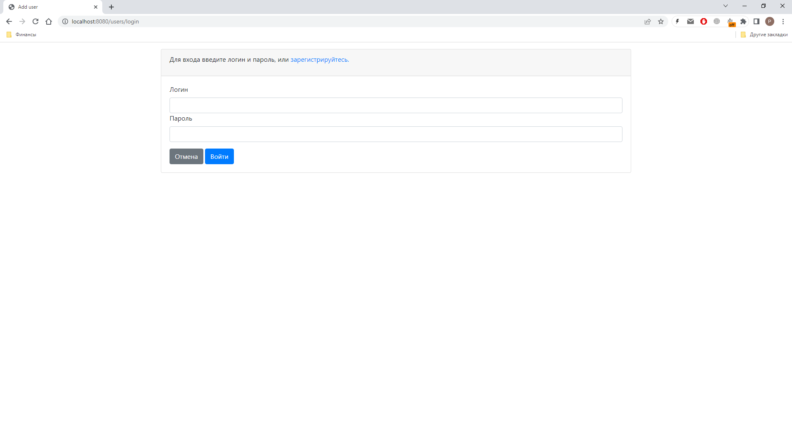

Приложение "TODO список".

Учебный проект job4j.ru.

Реализован список задач с возможностью добавлять, удалять и редактировать задачи.
Возможно 3 вида отображения задач: сделанные, несделанные, все задачи. Задачи состоят 
из полей: название, описание, дата создания, статус выполнения.
Возможность изменения задач доступна только зарегистрированным пользователям, без регистрации можно только просматривать задачи.

Применяющиеся технологии: Java 17, Spring boot 2.7.3, Thymeleaf 3.0.15, Bootstrap (4.4.1) , Hibernate 5.6.11, Postgresql (42.3.1).

Запуск программы: на данный момент запуск осуществляется с помощью файла Main.java (из консоли или IDE).
База данных со списком задач создается на машине пользователя при первом запуске.

Главное окно программы:

Список невыполненных задач:

Окно добавления задачи:

Окно редактирования задачи:

Окно аутентификации:
